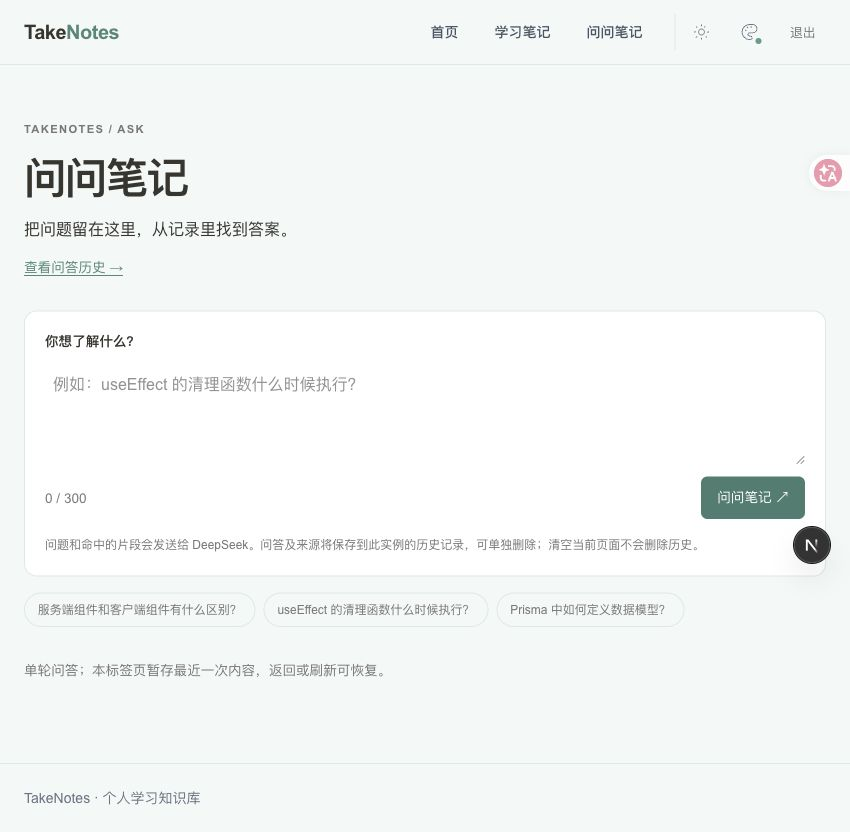

# TakeNotes

可自行部署的私人学习知识库，记录、整理和回顾笔记，并根据笔记进行 AI 问答。


## 功能

- 笔记新增、编辑、删除，支持搜索、标签筛选和分页
- Markdown 编辑与预览，支持表格、代码块和语言标注
- 阅读大纲、标题跳转与正文同步滚动
- AI 笔记问答，逐步显示答案，附来源链接与原文摘录
- 问答暂存与历史记录，支持回看、删除和停止生成
- 管理员登录、夜间模式、多套主题色与响应式布局

## 界面

<details>
<summary>问问笔记</summary>



</details>

<details>
<summary>阅读大纲与夜间模式</summary>


</details>

## 技术栈

Next.js 16 · React 19 · TypeScript · Tailwind CSS 4 · Prisma 7 / SQLite · Vercel AI SDK / DeepSeek · Docker Compose

## 快速开始

需要 Node.js 24 和 pnpm 11。

```bash
git clone https://github.com/bluedinosaur233/TakeNotes.git
cd TakeNotes
pnpm install
cp .env.example .env
pnpm setup:admin
pnpm db:deploy
pnpm dev
```

打开 <http://localhost:3000>。管理员工具会生成本地配置；已有环境文件不要覆盖，换端口时同步修改 `APP_URL`。

可选运行 `pnpm db:seed` 导入十篇示例笔记。重复执行会覆盖相同示例笔记的修改，不影响自行新增的笔记。

### 启用 AI 问答

在 `.env.local` 中补充以下配置，保留已有管理员配置，然后重启服务：

```dotenv
DEEPSEEK_API_KEY="填写你的密钥"
DEEPSEEK_MODEL="deepseek-flash"
```

模型名按账户支持情况调整。不配置密钥也能使用笔记功能。问答会将问题和相关笔记片段发送给 DeepSeek，并消耗 API 额度。

当前为基于关键词检索的单轮问答，答案请结合来源核对。历史保存提问时的摘录，删除原笔记不会同步删除历史；清空当前问答也不会删除服务器历史。

## 部署与维护

支持 Docker Compose 自部署和可选 Caddy HTTPS，详见 [部署指南](deploy/README.md)。

每份部署由一个管理员使用，不提供公开注册或多用户隔离。公网使用须配置 HTTPS、强密码并定期备份；密钥、数据库和备份不要提交到仓库。

```bash
pnpm db:backup  # 升级前备份
pnpm db:deploy  # 应用数据库迁移
pnpm test:qa   # 自动化测试
pnpm lint      # 代码检查
pnpm build     # 生产构建
```
