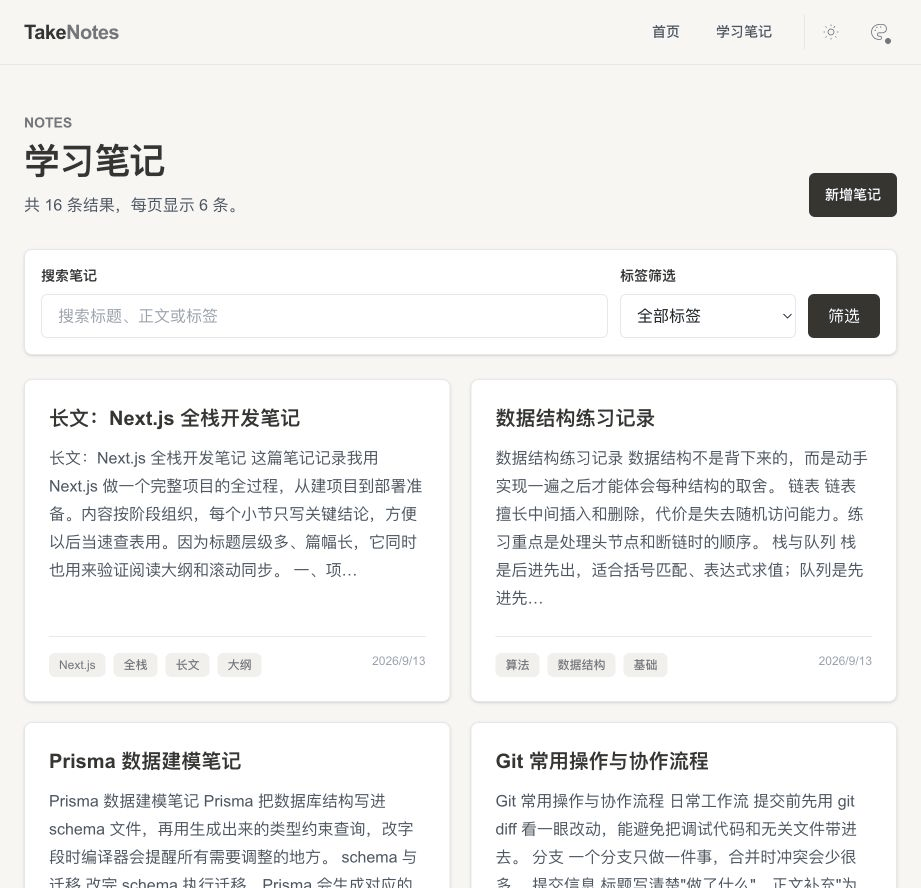
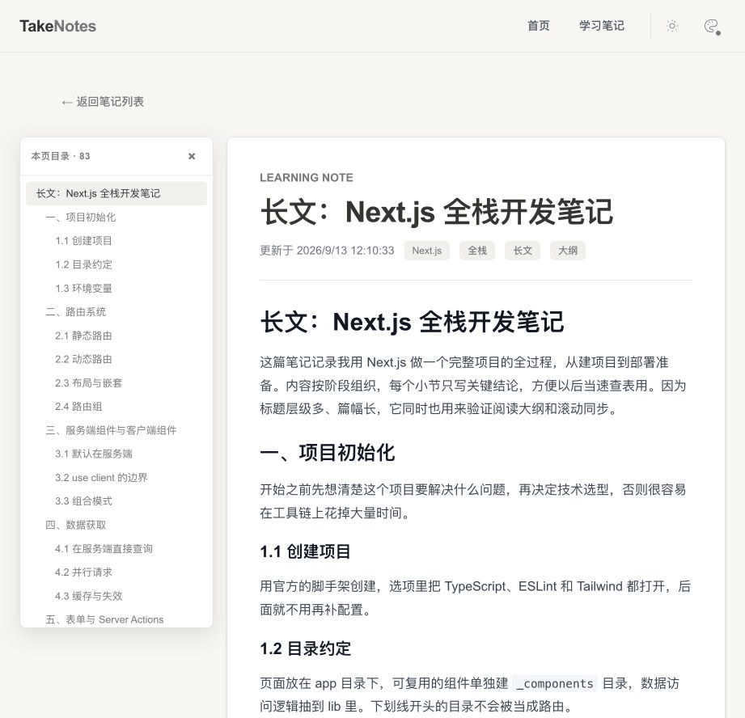
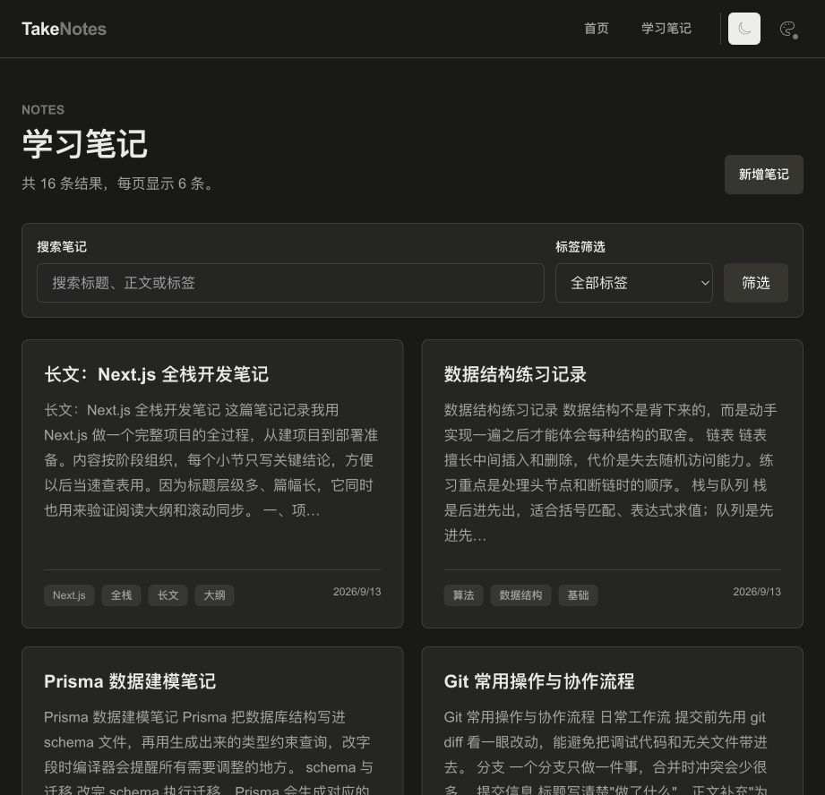

# TakeNotes

TakeNotes 是一个使用 Next.js App Router 构建的个人学习知识库，用于记录、整理和回顾学习笔记。



## 当前功能

- 笔记的新增、编辑、删除和浏览
- 标题、正文和标签管理
- 关键词搜索、标签筛选和分页
- Markdown 编辑与实时预览，支持标题、列表、引用、表格和代码块
- 代码块显示语言名称
- 阅读大纲：列出当前笔记的标题，点击跳转到正文对应位置
- 夜间模式与多套主题色
- 加载中、出错和内容为空的提示
- 适配手机与桌面屏幕

## 界面

笔记详情页的阅读大纲会列出当前笔记的所有标题，点击直接跳到正文对应位置。笔记很长时，目录和正文的滚动位置会保持同步。



夜间模式和多套主题色会一起调整背景、文字、边框和按钮，配色保存在浏览器里，下次打开还是同样的设置。



## 技术栈

- Next.js 16（App Router）
- React 19
- TypeScript
- Tailwind CSS 4
- Prisma 7
- SQLite
- pnpm

## 本地运行

环境要求：Node.js 20+、pnpm。

```bash
pnpm install
cp .env.example .env
pnpm db:migrate
pnpm dev
```

`pnpm db:migrate` 会执行 `prisma migrate dev`，并按 `prisma7.config.ts` 里的配置自动运行 `prisma/seed.ts`，写入十篇示例笔记。克隆下来就能直接看到带内容的界面。

打开 <http://localhost:3000>。

常用命令：

```bash
pnpm lint
pnpm build
pnpm db:seed
pnpm db:validate
pnpm db:studio
```

`pnpm db:seed` 用来重新写入示例笔记。它使用固定 id 做 upsert，因此可以重复执行，不会产生重复记录。

## 项目结构

```text
src/app/              页面、路由和 Server Actions
src/app/notes/        笔记列表、详情及表单
src/app/_components/  全局共享组件
src/lib/              Prisma Client 等服务端工具
prisma/               数据模型、数据库迁移和示例数据
```

## 数据库

开发环境使用项目根目录的 SQLite 数据库 `dev.db`。数据库文件和环境变量不会提交到 Git；仓库提供 `.env.example` 作为配置示例。

示例数据放在 `prisma/seed-data.ts`，写入逻辑在 `prisma/seed.ts`。想调整示例笔记的内容，直接改 `seed-data.ts` 再执行 `pnpm db:seed` 即可。
